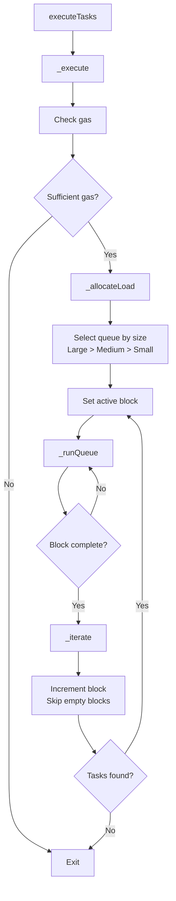
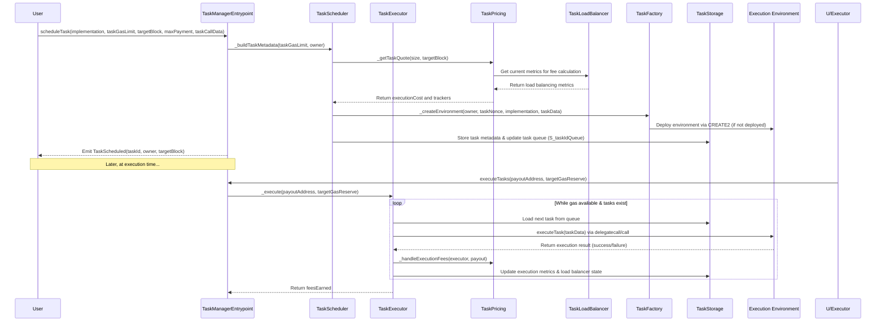
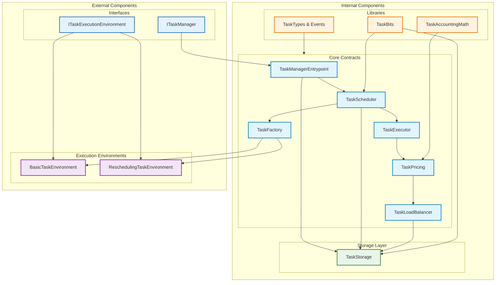

# Task Manager

Task scheduling and execution system for Monad blockchain using shMONAD for economic security.

## Overview

The Task Manager enables scheduling and execution of smart contract tasks with:
- Gas-based task categorization
- Block-based scheduling
- Economic security via shMONAD bonding

## Architecture

Core system components:

1. **TaskManagerEntrypoint**
   - Public interface
   - Access control and validation
   - Task scheduling and execution
   - Reentrancy protection

2. **TaskScheduler**
   - Task scheduling
   - Task quoting
   - Block-based scheduling
   - Task cancellation

3. **TaskExecutor**
   - Task execution
   - Environment management
   - Fee distribution
   - Execution safety

4. **LoadBalancer**
   - Load distribution
   - Block-based metrics
   - Task allocation
   - Performance tracking

5. **TaskPricing**
   - Fee calculation
   - Period-based averaging
   - Congestion adjustment
   - Base fee management

6. **TaskFactory**
   - Environment creation
   - CREATE2 deployment
   - Parameter embedding
   - Address generation

7. **TaskStorage**
   - State management
   - Metadata tracking
   - Load balancer state
   - Task queues

## Execution Environments

1. **BasicTaskEnvironment**
   - Provides isolated execution context
   - Validates pre-execution conditions
   - Logs execution events
   - Uses simple call pattern

2. **ReschedulingTaskEnvironment**
   - Extends basic environment
   - Adds automatic retry logic
   - Handles task rescheduling
   - Tracks execution attempts

## Core Interface

```solidity
interface ITaskManager {
    // Task Management
    function scheduleTask(Task calldata task, uint64 targetBlock) external returns (bytes32 taskId);
    function scheduleTaskWithQuote(Task calldata task, uint64 targetBlock, uint256 maxPayment) 
        external returns (bool scheduled, uint256 executionCost, bytes32 taskId);
    function cancelTask(bytes32 taskId) external;
    
    // Task Execution
    function executeQueuedTasks(address payoutAddress, uint256 targetGasReserve) 
        external returns (uint256 feesEarned, bool success);
    
    // Task Information
    function getAccountNonce(address account) external view returns (uint64);
    function estimateRequiredBond(Task calldata task, uint64 targetBlock) external view returns (uint256);
    function getTaskMetadata(bytes32 taskId) external view returns (TaskMetadata memory);
    function getNextExecutionBlockInRange(uint64 startBlock, uint64 endBlock) external view returns (uint64);
}
```

## Task Structure

```solidity
struct Task {
    address from;      // Task owner
    uint64 nonce;      // Account nonce
    Size size;         // Task size category
    bool cancelled;    // Cancellation status
    address target;    // Target contract
    bytes data;        // Execution data
}

enum Size {
    Small,   // <= 100,000 gas
    Medium,  // <= 250,000 gas
    Large    // <= 750,000 gas
}

struct TaskMetadata {
    address owner;    // Task owner
    uint64 nonce;     // Task nonce
    bool isActive;    // Active status
}
```

## Economic Security

The system uses shMONAD for economic security:
- Tasks require bonded shMONAD for execution
- Bond amounts are calculated dynamically based on:
  - Historical execution costs
  - Task size category
  - Block distance
  - Network congestion
- Fees are distributed between:
  - Executors (95%)
  - Protocol (5%)

## Load Balancing

The system implements a sophisticated load balancing mechanism:
- Multi-depth tracking system (B, C, D trackers)
- Dynamic fee adjustment based on historical data
- Block-based task distribution
- Bayesian prior updates for low demand periods
- Congestion-aware scheduling

## Load Balancer Workflow

The TaskLoadBalancer module manages task execution across different sizes and blocks:

### 1. Queue Selection at Execution Start
- **Execution Entry Point**
  - `executeTasks` call is delegated to `_execute` in TaskExecutor
  - Initial gas calculations and safety checks performed

- **Allocating Load**
  - `_allocateLoad` determines queue based on available gas
  - Reserves gas for post-execution operations
  - Checks queues in order: Large → Medium → Small
  - Selects earliest active block with pending tasks

### 2. Running the Selected Queue
- **Task Loading**
  - `_loadNextTask` fetches next task from current block
  - Validates task metadata and execution requirements

- **Task Execution**
  - Invokes task environment with size-specific gas limit
  - Handles execution results and state updates

- **Fee Handling**
  - `_getReimbursementAmount` computes fees
  - Updates execution metrics and distributes payments

### 3. Block Iteration
- **Block Advancement**
  - `_iterate` triggers when current block is complete
  - Uses bitmap flags for efficient block skipping
  - Leverages `_GROUP_SIZE` and `_BITMAP_SPECIFICITY` for optimization

- **State Management**
  - Updates metrics via `_storeSpecificTracker`
  - Maintains load balancer pointers
  - Ensures consistent state across executions

### 4. System Integration
- **Pricing Integration**
  - Provides metrics for dynamic fee calculation
  - Supports multi-depth tracking for fee adjustments

- **State Persistence**
  - Maintains execution metrics at block, group, and supergroup levels
  - Ensures consistent load balancer state across iterations

### Execution Flow



## Task Flow



## Component Architecture



## Execution Environment

Tasks are executed in isolated environments:
- Deterministic addressing using CREATE2
- One environment per task
- No persistent state
- Strict gas limits per size category
- Comprehensive reentrancy protection

## Events

```solidity
event TaskScheduled(bytes32 indexed taskId, address indexed owner, uint64 targetBlock);
event ExecutionEnvironmentCreated(address indexed owner, address environment, address implementation, uint64 taskNonce);
event ExecutorReimbursed(address indexed executor, uint256 amount);
event ProtocolFeeCollected(uint256 amount);
```

## Usage Example

```solidity
// Create a task
Task memory task = Task({
    from: msg.sender,
    nonce: taskManager.getAccountNonce(msg.sender),
    size: Size.Small,
    cancelled: false,
    target: targetContract,
    data: encodedCalldata
});

// Get required bond
uint256 requiredBond = taskManager.estimateRequiredBond(task, targetBlock);

// Bond shMONAD
shMonad.bond(taskManager.POLICY_ID(), requiredBond);

// Schedule task
bytes32 taskId = taskManager.scheduleTask(task, targetBlock);
```

## Security Model

1. **Execution Isolation**
   - Isolated environments per task
   - No cross-task interference
   - Clean execution context

2. **Access Control**
   - Owner-based task management
   - Executor-only task execution
   - Protocol-controlled fee distribution

3. **Economic Security**
   - shMONAD-based bonding
   - Dynamic fee calculation
   - Fair distribution model

4. **Safety Measures**
   - Comprehensive reentrancy protection
   - Strict gas limits
   - Safe transfer patterns
   - Immutable critical addresses

## Libraries and Utilities

1. **TaskBits**
   - Efficient task metadata packing
   - Unpacking utilities
   - Storage optimization

2. **TaskAccountingMath**
   - Fee calculation helpers
   - Protocol fee constants
   - Weighted average computation

3. **Types and Errors**
   - Shared data structures
   - Custom error definitions
   - Event declarations